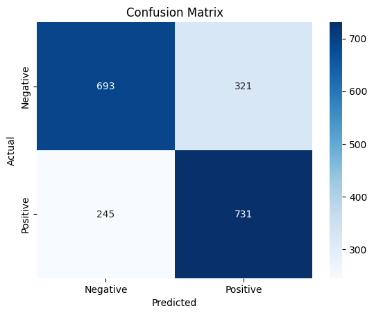

# Social Media Sentiment Analysis  
**AI & Data Science Internship Project — Logicbox IT Solutions**

---

## Project Overview

This project was completed as part of a three-month internship as an **AI & Data Science Intern** at **Logicbox IT Solutions**. The objective was to build a sentiment analysis system capable of classifying user-generated content from social media platforms into positive or negative categories using natural language processing and machine learning techniques.

The project simulates a real-world use case where sentiment analysis supports digital marketing teams in measuring audience engagement and content effectiveness.

---

## Objectives

- Develop a machine learning model to classify tweet sentiment.
- Apply natural language preprocessing techniques for text cleaning.
- Evaluate model performance on a labeled dataset.
- Demonstrate the applicability of AI in digital marketing strategy optimization.

---

## Dataset Details

- **Source**: [Sentiment140 Dataset](https://www.kaggle.com/kazanova/sentiment140)  
- **Sample Size Used**: 10,000 tweets (balanced sample)
- **Labels**:
  - `0`: Negative
  - `4`: Positive  
  Neutral class (`2`) was excluded for binary classification.
- **Columns Used**: `text`, `sentiment`

---

## Data Preprocessing

The following preprocessing steps were applied to the raw tweet text:

1. Removal of:
   - User mentions (e.g., `@username`)
   - URLs and hashtags
   - Non-alphabetical characters
2. Conversion to lowercase
3. Tokenization and removal of English stopwords
4. Stemming using PorterStemmer
5. Removal of null or empty rows

Processed text was then used for feature extraction using TF-IDF vectorization.

---

## Technologies and Tools

- **Programming Language**: Python
- **Libraries**:
  - Pandas, NumPy
  - NLTK (Natural Language Toolkit)
  - Scikit-learn
  - Matplotlib, Seaborn
- **IDE/Platform**: Google Colab
- **Version Control**: GitHub

---

## Model Development

- **Vectorization**: TF-IDF
- **Algorithm**: Logistic Regression
- **Train-Test Split**: 80% Training, 20% Testing
- **Evaluation Metrics**:
  - Accuracy
  - Precision
  - Recall
  - F1-Score
  - Confusion Matrix

---

## Model Performance

| Metric       | Score       |
|--------------|-------------|
| Accuracy     | 71.56%      |
| Precision    | 0.69 – 0.74 |
| F1-Score     | ~0.72       |
| Test Samples | 1,990       |

### Confusion Matrix

|                | Predicted Negative | Predicted Positive |
|----------------|--------------------|--------------------|
| Actual Negative| 693                | 321                |
| Actual Positive| 245                | 731                |

---

## Files Included

- `sentiment_analysis.ipynb`: Full Colab notebook
- `cleaned_sentiment140_sample.csv`: Cleaned input dataset
- `confusionmatrix.png`: Final confusion matrix plot
- `README.md`: Project documentation

---

## Internship Context

This project was developed as part of an internal initiative during the internship at **Logicbox IT Solutions**, a company providing services in digital marketing, mobile/web development, and online engagement strategy. The analysis supports potential applications of AI and NLP in enhancing content planning and customer feedback analysis.

---

## How to Run

1. Upload `sentiment_analysis.ipynb` to [Google Colab](https://colab.research.google.com)
2. Upload `cleaned_sentiment140_sample.csv` in runtime
3. Run each code cell to reproduce the analysis and model results

---

## Contact

For queries or collaboration opportunities, please reach out via [LinkedIn](https://www.linkedin.com/in/mayankojha2228/) or GitHub.

